# 🖥️ 나만의 채용 서비스 백엔드 서버 리팩토링


## 프로젝트 소개
- 프로젝트 이름 : SPA_Recruit_3_Layered
- 내용 : 기존 나만의 채용 서비스 백엔드 서버를 3-Layered Architecture Pattern 형태로 리팩토링
- 구분 : 개인 프로젝트
- 배포 : https://www.mymycode.shop/api/... (API 명세서 참조)


## 1. 개발 기간
- 2024.06.12 ~ 2024.06.14

<br>

## 2. 개발 환경
- BackEnd : Node.js, Express, MySQL(Prisma)
- Tool : AWS, Insomnia, DBeaver

<br>

## 3. API 명세서 및 ERD
 - API 명세서 : https://west-territory-778.notion.site/Node-js-API-ec55e0bdd9c24242a75c99766c90589e?pvs=4
 - ERD : https://drawsql.app/teams/nodejs-express/diagrams/spa-recruit

<br>

## 4. 주요 기능 및 설명
### 4-1. Jest 설치 및 설정
- jest, cross-env, @jest/globals 모듈 설치
```bash
# DevDependencies로 jest, cross-env 를 설치합니다.
yarn add -D jest cross-env @jest/globals
```
- Jest Config 설정
```javascript
export default {
    // 해당 패턴에 일치하는 경로가 존재할 경우 테스트를 하지 않고 넘어갑니다.
    testPathIgnorePatterns: ['/node_modules/'],
    // 테스트 실행 시 각 TestCase에 대한 출력을 해줍니다.
    verbose: true,
    // *.test.js, *.spec.js 파일만 테스트 파일로 인식해서 실행합니다.
    testRegex: '.*\\.(test|spec)\\.js$',
};
```
- Jest Script 설정
```javascript
// package.json

{
  ...

  "scripts": {
    ...

    "test": "cross-env NODE_ENV=test NODE_OPTIONS=--experimental-vm-modules jest --forceExit",
    "test:silent": "cross-env NODE_ENV=test NODE_OPTIONS=--experimental-vm-modules jest --silent --forceExit",
    "test:coverage": "cross-env NODE_ENV=test NODE_OPTIONS=--experimental-vm-modules jest --coverage --forceExit",
    "test:unit": "cross-env NODE_ENV=test NODE_OPTIONS=--experimental-vm-modules jest __tests__/unit --forceExit"
  },

  ...
}
```

<br>

### 4-2. 회원가입 Controller, Service, Repository
#### 4-2-1. 회원가입 Controller
- 이메일, 비밀번호, 비밀번호 확인, 이름, 나이, 성별, 프로필을 Request Body(`req.body`)로 전달 받음

- 각종 에러 처리를 담당

- 사용자 ID, 역할, 생성일시, 수정일시는 자동 생성됨

- Auth Service로 이메일, 비밀번호, 비밀번호 확인, 이름, 나이, 성별, 프로필 전달

- https://github.com/jkc-mycode/spa_recruit_3_layered/blob/c7eb054f8096fd59097e9012bb3328f1ad41af5d/src/controllers/auth.controller.js#L9-L31

#### 4-2-2. 회원가입 Service
- User Repository에 이메일로 사용자 정보를 요청하는 비즈니스 로직 수행

- 받아온 사용자 정보로 중복된 이메일인지 확인

- 보안을 위해 **비밀번호**는 평문(Plain Text)으로 저장하지 않고 **Hash** 된 값을 저장

- User Repository에 사용자를 생성을 요청하는 비즈니스 로직 수행

- https://github.com/jkc-mycode/spa_recruit_3_layered/blob/c7eb054f8096fd59097e9012bb3328f1ad41af5d/src/services/auth.service.js#L13-L43

#### 4-2-3. 회원가입 Repository
- 회원가입에서는 Auth Repository를 사용하지 않음


<br>


### 4-3. 로그인 Controller, Service, Repository
#### 4-3-1. 로그인 Controller
- 이메일, 비밀번호를 Request Body(`req.body`)로 전달 받음

- Auth Service에 로그인을 위한 이메일, 비밀번호, IP, 사용자 에이전트를 전달

- https://github.com/jkc-mycode/spa_recruit_3_layered/blob/c7eb054f8096fd59097e9012bb3328f1ad41af5d/src/controllers/auth.controller.js#L33-L54

#### 4-3-2. 로그인 Service
- User Repository에 이메일로 사용자 조회하기 위해 이메일을 전달

- `jwt` 모듈을 사용해서 **Access Token** 발급하는 비즈니스 로직 수행

- `jwt` 모듈을 사용해서 **Refresh Token** 발급하는 비즈니스 로직 수행

- **AccessToken**(Payload에 `사용자 ID`를 포함하고, 유효기한이 `12시간`)을 생성

- **RefreshToken**(Payload에 `사용자 ID`를 포함하고, 유효기한이 `7일`)을 생성

- Auth Repository에 토큰 `upsert`를 진행하기 위해 사용자ID, RefreshToken, IP, 사용자 에이전트를 전달

- https://github.com/jkc-mycode/spa_recruit_3_layered/blob/c7eb054f8096fd59097e9012bb3328f1ad41af5d/src/services/auth.service.js#L45-L67

#### 4-3-3. 로그인 Repository
- Prisma를 통해 직접 DB에 접근해서 `upsert` 메서드 수행
  
- 데이터베이스에 **RefreshToken**을 **생성** 또는 **갱신**

- https://github.com/jkc-mycode/spa_recruit_3_layered/blob/c7eb054f8096fd59097e9012bb3328f1ad41af5d/src/repositories/auth.repository.js#L6-L15


<br>


### 4-4. AccessToken 인증 Middleware 리팩토링
- **AccessToken**을 **Request Header**의 Authorization 값(`req.headers.authorization`)으로 전달 받음

- 조건문과 `try ~ catch문`을 이용해서 유효성 검사

- Payload에 담긴 **사용자 ID**를 이용하여 **사용자 정보를 조회**

- 조회 된 사용자 정보를 `req.user`에 담고, 다음 동작을 진행

- 데이터베이스에서 사용자 정보 중 `password`를 제외한 데이터를 가져오기 위해 Prisma `omit` 기능 사용

- (리팩토링) 기존의 Prisma 클라이언트를 통해 데이터베이스에 접근하는 코드를 Service 계층을 통해서 Repository -> DB 순서로 접근해서 데이터를 가져오도록 수정함

- https://github.com/jkc-mycode/spa_recruit_3_layered/blob/2d53125edda3986f3bccb1513cb2d6c8d76f4581/src/middlewares/auth.access.token.middleware.js#L8


<br>


### 4-5. 내 정보 조회 Controller, Service, Repository
#### 4-5-1. 내 정보 조회 Controller
- 사용자 정보는 인증 Middleware(`req.user`)를 통해서 전달 받음

- **사용자 ID, 이메일, 이름, 역할, 생성일시, 수정일시**를 반환

- `authMiddleware`를 통해서 사용자 검증을 거치기 때문에 DB에서 사용자 검색을 할 필요가 없음

- 그렇기에 User Controller에서 User Service에게 데이터를 요청할 필요가 없음

- 인증 미들웨어 -> Service -> Repository -> DB -> Repository -> Service -> 인증 미들웨어 -> Controller 순서로 실행됨

- https://github.com/jkc-mycode/spa_recruit_3_layered/blob/c7eb054f8096fd59097e9012bb3328f1ad41af5d/src/controllers/user.controller.js#L9-L15

#### 4-5-2. 내 정보 조회 Service
- User Repository에 사용자 ID로 사용자 정보를 요청하기 위한 사용자 ID 전달

- https://github.com/jkc-mycode/spa_recruit_3_layered/blob/2d53125edda3986f3bccb1513cb2d6c8d76f4581/src/services/user.service.js#L7

#### 4-5-3. 내 정보 조회 Repository
- Prisma를 통해 직접 DB에 접근해서 사용자 ID로 사용자를 조회 수행

- https://github.com/jkc-mycode/spa_recruit_3_layered/blob/c7eb054f8096fd59097e9012bb3328f1ad41af5d/src/repositories/user.repository.js#L22-L30


<br>


### 4-7. 이력서 생성 Controller, Service, Repository
#### 4-6-1. 이력서 생성 Controller
- 사용자 정보는 인증 Middleware(`req.user`)를 통해서 전달 받음

- 제목, 자기소개는 Request Body(`req.body`)로 전달 받음

- 이력서 ID, 지원 상태, 생성일시, 수정일시는 자동 생성

- Resume Service에 이력서 생성을 위한 사용자 ID, 이력서 제목, 자기소개를 전달

- https://github.com/jkc-mycode/spa_recruit_3_layered/blob/c7eb054f8096fd59097e9012bb3328f1ad41af5d/src/controllers/resume.controller.js#L10-L27

#### 4-6-2. 이력서 생성 Service
- Resume Repository에 이력서 생성 위한 사용자 ID, 이력서 제목, 자기소개를 전달

- https://github.com/jkc-mycode/spa_recruit_3_layered/blob/c7eb054f8096fd59097e9012bb3328f1ad41af5d/src/services/resume.service.js#L11-L16

#### 4-6-3. 이력서 생성 Repository
- Prisma를 통해 직접 DB에 접근해서 이력서 생성을 수행

- https://github.com/jkc-mycode/spa_recruit_3_layered/blob/c7eb054f8096fd59097e9012bb3328f1ad41af5d/src/repositories/resume.repository.js#L9-L16


<br>

### 4-7. 이력서 목록 조회 Controller, Service, Repository
#### 4-7-1. 이력서 목록 조회 Controller
- 사용자 정보는 인증 Middleware(`req.user`)를 통해서 전달 받음

- Query Parameters(`req.query`)으로 정렬 조건을 받음

- Query Parameters(`req.query`)으로 필터링 조건을 받음

- 지원 상태 별 필터링 조건을 받음 ex) `sort=desc&status=APPLY`

- **현재 로그인 한 사용자**가 작성한 이력서 목록만 조회

- `sort` 쿼리에 `desc`, `acs` 둘 다 아닐 경우에 대해서 처리하지 않아서 추가함

- https://github.com/jkc-mycode/spa_recruit_3_layered/blob/c7eb054f8096fd59097e9012bb3328f1ad41af5d/src/controllers/resume.controller.js#L29-L48

#### 4-7-2. 이력서 목록 조회 Service
- 채용 담당자인지를 판별하기 위한 비즈니스 로직 수행

- **역할**이 `RECRUITER` 인 경우 **모든 사용자**의 이력서를 조회 할 수 있음

- `where절`에는 객체가 들어가기에 `whereCondition`이라는 객체를 만들어서 `Prisma` 조건절에 사용

- Resume Repository에 이력서 목록 조회를 위한 where절 객체와 데이터를 전달

- https://github.com/jkc-mycode/spa_recruit_3_layered/blob/c7eb054f8096fd59097e9012bb3328f1ad41af5d/src/services/resume.service.js#L39-L74

#### 4-7-3. 이력서 목록 조회 Repository
- Prisma를 통해 직접 DB에 접근해서 전달받은 `whereCondition`에 따라 이력서 목록 조회 수행

- https://github.com/jkc-mycode/spa_recruit_3_layered/blob/c7eb054f8096fd59097e9012bb3328f1ad41af5d/src/repositories/resume.repository.js#L18-L27


<br>


### 4-8. 이력서 상세 조회 Controller, Service, Repository
#### 4-8-1. 이력서 상세 조회 Controller
- 사용자 정보는 인증 Middleware(`req.user`)를 통해서 전달 받음

- 이력서 ID를 Path Parameters(`req.params`)로 전달 받음

- **현재 로그인 한 사용자가 작성한 이력서만** 조회

- https://github.com/jkc-mycode/spa_recruit_3_layered/blob/c7eb054f8096fd59097e9012bb3328f1ad41af5d/src/controllers/resume.controller.js#L50-L67

#### 4-8-2. 이력서 상세 조회 Service
- 채용 담당자인지를 판별하기 위한 비즈니스 로직 수행

- **역할**이 `RECRUITER` 인 경우 **이력서 작성 사용자와 일치하지 않아도** 이력서를 조회할 수 있음

- `where절`에는 객체가 들어가기에 `whereCondition`이라는 객체를 만들어서 조건문을 통해서 값을 결정함

- Resume Repository에 이력서 ID, 작성자 ID가 모두 일치한 이력서 조회를 위해 where절 객체를 전달

- https://github.com/jkc-mycode/spa_recruit_3_layered/blob/c7eb054f8096fd59097e9012bb3328f1ad41af5d/src/services/resume.service.js#L76-L97

#### 4-8-3. 이력서 상세 조회 Repository
- **작성자 ID가 아닌 작성자 이름을 반환**하기 위해 스키마에 정의 한 **Relation을 활용**해 조회 (include 문법 사용)

- Prisma를 통해 직접 DB에 접근해서 전달받은 `whereCondition`에 따라 이력서 목록 조회 수행

- https://github.com/jkc-mycode/spa_recruit_3_layered/blob/c7eb054f8096fd59097e9012bb3328f1ad41af5d/src/repositories/resume.repository.js#L29-L37


<br>


### 4-9. 이력서 수정 Controller, Service, Repository
#### 4-9-1. 이력서 수정 Controller
- 사용자 정보는 인증 Middleware(`req.user`)를 통해서 전달 받음

- 이력서 ID를 Path Parameters(`req.params`)로 전달 받음

- 제목, 자기소개를 Request Body(`req.body`)로 전달 받음

- **현재 로그인 한 사용자가 작성한 이력서**만 수정할 수 있음

- https://github.com/jkc-mycode/spa_recruit_3_layered/blob/c7eb054f8096fd59097e9012bb3328f1ad41af5d/src/controllers/resume.controller.js#L69-L89

#### 4-9-2. 이력서 수정 Service
- 이력서 조회 시 **이력서 ID, 작성자 ID가 모두 일치**해야 함

- Resume Repository에 이력서 ID, 작성자 ID가 모두 일치한 이력서 조회를 위해 where절 객체를 전달

- Resume Repository에 이력서 수정을 요청하기 위해 where객체와 수정될 제목, 자기소개를 전달

- https://github.com/jkc-mycode/spa_recruit_3_layered/blob/c7eb054f8096fd59097e9012bb3328f1ad41af5d/src/services/resume.service.js#L99-L109

#### 4-9-3. 이력서 수정 Repository
- Prisma를 통해 직접 DB에 접근해서 전달받은 데이터로 이력서 수정 수행

- 제목, 자기소개가 수정이 될 수도 안될 수도 있기에 `...` 연산자를 통해서 구현

- https://github.com/jkc-mycode/spa_recruit_3_layered/blob/c7eb054f8096fd59097e9012bb3328f1ad41af5d/src/repositories/resume.repository.js#L39-L50


<br>


### 4-10. 이력서 삭제 Controller, Service, Repository
#### 4-10-1. 이력서 삭제 Controller
- 사용자 정보는 인증 Middleware(`req.user`)를 통해서 전달 받음

- 이력서 ID를 Path Parameters(`req.params`)로 전달 받음

- **현재 로그인 한 사용자가 작성한 이력서만** 삭제

- Resume Service에 이력서 삭제를 위해 이력서 ID와 사용자 ID 전달

- https://github.com/jkc-mycode/spa_recruit_3_layered/blob/c7eb054f8096fd59097e9012bb3328f1ad41af5d/src/controllers/resume.controller.js#L91-L110

#### 4-10-2. 이력서 삭제 Service
- 이력서 조회 시 **이력서 ID, 작성자 ID가 모두 일치**해야 함

- Resume Repository에 이력서 ID에 해당하는 이력서 조회를 위한 이력서 ID 전달(이력서 유무 파악)

- Resume Repository에 이력서 삭제 요청을 하기 위해 where절 객체 전달

- https://github.com/jkc-mycode/spa_recruit_3_layered/blob/c7eb054f8096fd59097e9012bb3328f1ad41af5d/src/services/resume.service.js#L111-L121

#### 4-10-3. 이력서 삭제 Repository
- Prisma를 통해 직접 DB에 접근해서 전달받은 이력서 ID와 같은 이력서 삭제 수행

- DB에서 이력서 정보를 직접 삭제 (Hard Delete)

- https://github.com/jkc-mycode/spa_recruit_3_layered/blob/c7eb054f8096fd59097e9012bb3328f1ad41af5d/src/repositories/resume.repository.js#L52-L60


<br>


### 4-11. 이력서 지원 상태 변경 Controller, Service, Repository
#### 4-11-1. 이력서 지원 상태 변경 Controller
- 사용자 정보는 인증 Middleware(`req.user`)를 통해서 전달 받음

- **이력서 ID**를 Path Parameters(`req.params`)로 전달 받음

- **지원 상태, 사유**를 **Request Body**(**`req.body`**)로 전달 받음

- **역할**이 `RECRUITER` 인 경우만 이력서 지원 상태 변경 가능

- Resume Service에 이력서 상태를 변경하기 위해 사용자 ID, 이력서 ID, 새로운 상태, 변경 사유를 전달

- https://github.com/jkc-mycode/spa_recruit_3_layered/blob/c7eb054f8096fd59097e9012bb3328f1ad41af5d/src/controllers/resume.controller.js#L112-L131

#### 4-11-2. 이력서 지원 상태 변경 Service
- Repository에 이력서 상태 변경을 요청하기 위한 비즈니스 로직 수행

- Resume Repository에 이력서 ID에 해당하는 이력서 조회를 위한 이력서 ID 전달(이력서 유무 파악)

- Resume Repository에 이력서 지원 상태 변경 요청 하기 위해 사용자 ID, 이력서 ID, 이전 상태, 새로운 상태, 변경 사유를 전달

- https://github.com/jkc-mycode/spa_recruit_3_layered/blob/c7eb054f8096fd59097e9012bb3328f1ad41af5d/src/services/resume.service.js#L123-L139


#### 4-11-3. 이력서 지원 상태 변경 Repository
- Prisma를 통해 직접 DB에 접근해서 이력서 수정 및 로그 생성 수행

- 이력서 정보 수정과 이력서 로그 생성을 **Transaction**으로 묶어서 실행

- https://github.com/jkc-mycode/spa_recruit_3_layered/blob/c7eb054f8096fd59097e9012bb3328f1ad41af5d/src/repositories/resume.repository.js#L62-L83


<br>


### 4-12. 이력서 로그 목록 조회 Controller, Service, Repository
#### 4-12-1. 이력서 로그 목록 조회 Controller
- **이력서 ID**를 Path Parameters(`req.params`)로 전달 받음

- **생성일시** 기준 **최신순**으로 조회

- Resume Service에 이력서 로그 조회를 위해 이력서 ID 전달

- https://github.com/jkc-mycode/spa_recruit_3_layered/blob/c7eb054f8096fd59097e9012bb3328f1ad41af5d/src/controllers/resume.controller.js#L133-L150

#### 4-12-2. 이력서 로그 목록 조회 Service
- Repository에 이력서 로그 조회를 요청하기 위한 비즈니스 로직 수행

- Resume Repository에 이력서 ID에 해당하는 이력서 조회를 위한 이력서 ID 전달(이력서 유무 파악)

- Resume Repository에 이력서 로그 조회를 위해 이력서 ID 전달

- 반환된 데이터를 출력 양식에 알맞게 수정

- https://github.com/jkc-mycode/spa_recruit_3_layered/blob/c7eb054f8096fd59097e9012bb3328f1ad41af5d/src/services/resume.service.js#L141-L164

#### 4-12-3. 이력서 로그 목록 조회 Repository
- Prisma를 통해 직접 DB에 접근해서 이력서 로그 목록 조회 수행

- **채용 담당자 이름**을 반환하기 위해 스키마에 정의 한 **Relation**을 활용해 조회

- `include`를 사용해서 참조된 User 정보를 가져옴

- https://github.com/jkc-mycode/spa_recruit_3_layered/blob/c7eb054f8096fd59097e9012bb3328f1ad41af5d/src/repositories/resume.repository.js#L85-L94


<br>


### 4-13. 토큰 재발급 Controller, Service, Repository
#### 4-13-1. 토큰 재발급 Controller
- AccessToken 만료 시 RefreshToken을 활용해 재발급

- **RefreshToken**(JWT)을 **Request Header의 Authorization** 값(**`req.headers.authorization`**)으로 전달 받음

- 사용자 정보는 인증 Middleware(`req.user`)를 통해서 전달 받음 

- Auth Service에 토큰 재발급을 위한 이메일, 비밀번호, IP, 사용자 에이전트를 전달

- https://github.com/jkc-mycode/spa_recruit_3_layered/blob/c7eb054f8096fd59097e9012bb3328f1ad41af5d/src/controllers/auth.controller.js#L56-L77

#### 4-13-2. 토큰 재발급 Service
- `jwt` 모듈을 사용해서 Access Token 발급하는 비즈니스 로직 수행

- `jwt` 모듈을 사용해서 Refresh Token 발급하는 비즈니스 로직 수행

- **AccessToken(Payload**에 `사용자 ID`를 포함하고, **유효기한**이 `12시간`)을 재발급

- **RefreshToken** (**Payload**: **사용자 ID** 포함, **유효기한**: **`7일`**)을 재발급

- Auth Repository에 토큰 `upsert`를 진행하기 위해 사용자ID, RefreshToken, IP, 사용자 에이전트를 전달

- https://github.com/jkc-mycode/spa_recruit_3_layered/blob/c7eb054f8096fd59097e9012bb3328f1ad41af5d/src/services/auth.service.js#L69-L85

#### 4-13-3. 토큰 재발급 Repository
- Prisma를 통해 직접 DB에 접근해서 Refresh 토큰 생성 수행

- 이미 토큰이 존재하면 업데이트 수행

- RefreshToken은 **DB에서 보관**하기 때문에 DB의 데이터를 갱신

- https://github.com/jkc-mycode/spa_recruit_3_layered/blob/c7eb054f8096fd59097e9012bb3328f1ad41af5d/src/repositories/auth.repository.js#L6-L15


<br>


### 4-14. 로그아웃 Controller, Service, Repository
#### 4-14-1. 로그아웃 Controller
- **RefreshToken**(JWT)을 **Request Header의 Authorization** 값(**`req.headers.authorization`**)으로 전달 받음

- 사용자 정보는 인증 Middleware(`req.user`)를 통해서 전달 받음

- 실제로는 AccessToken이 만료되기 전까지는 AccessToken이 필요한 API는 사용 가능함

- Auth Service에 Refresh Token을 삭제하기 위한 사용자 ID 전달

- https://github.com/jkc-mycode/spa_recruit_3_layered/blob/c7eb054f8096fd59097e9012bb3328f1ad41af5d/src/controllers/auth.controller.js#L79-L97

#### 4-14-2. 로그아웃 Service
- Auth Repository에 기존의 Refresh Token를 조회 요청하기 위한 사용자 ID를 전달

- Auth Repository에 기존의 Refresh Token를 삭제 요청하기 위한 사용자 ID를 전달

- https://github.com/jkc-mycode/spa_recruit_3_layered/blob/c7eb054f8096fd59097e9012bb3328f1ad41af5d/src/services/auth.service.js#L87-L100

#### 4-14-3. 로그아웃 Repository
- Prisma를 통해 직접 DB에 접근해서 Refresh Token 조회 진행

- RefreshToken은 **DB에서 보관**하기 때문에 DB의 데이터를 삭제

- Prisma를 통해 직접 DB에 접근해서 Refresh Token 삭제 진행 (Hard Delete)

- https://github.com/jkc-mycode/spa_recruit_3_layered/blob/c7eb054f8096fd59097e9012bb3328f1ad41af5d/src/repositories/auth.repository.js#L17-L32


<br>


## 5. 테스트 코드(미완성)
### 5-1. 회원가입 Controller, Service, Repository 단위 테스트 코드
#### 5-1-1. 회원가입 Controller 단위 테스트 코드
- https://github.com/jkc-mycode/spa_recruit_3_layered/blob/39a215b906d3082a5bd472916165ad22a7f0467b/__tests__/unit/controllers/auth.controller.unit.spec.js#L46

#### 5-1-2. 회원가입 Service 단위 테스트 코드
- https://github.com/jkc-mycode/spa_recruit_3_layered/blob/39a215b906d3082a5bd472916165ad22a7f0467b/__tests__/unit/services/auth.service.unit.spec.js#L22-L109

#### 5-1-3. 회원가입 Repository 단위 테스트 코드
- https://github.com/jkc-mycode/spa_recruit_3_layered/blob/39a215b906d3082a5bd472916165ad22a7f0467b/__tests__/unit/repositories/auth.repository.unit.spec.js#L27-L115


<br>


### 5-2. 로그인 Controller, Service, Repository 단위 테스트 코드
#### 5-2-1. 로그인 Controller 단위 테스트 코드
- https://github.com/jkc-mycode/spa_recruit_3_layered/blob/39a215b906d3082a5bd472916165ad22a7f0467b/__tests__/unit/controllers/auth.controller.unit.spec.js#L129

#### 5-2-2. 로그인 Service 단위 테스트 코드
- https://github.com/jkc-mycode/spa_recruit_3_layered/blob/39a215b906d3082a5bd472916165ad22a7f0467b/__tests__/unit/services/auth.service.unit.spec.js#L111-L190

#### 5-2-3. 로그인 Repository 단위 테스트 코드
- https://github.com/jkc-mycode/spa_recruit_3_layered/blob/39a215b906d3082a5bd472916165ad22a7f0467b/__tests__/unit/repositories/auth.repository.unit.spec.js#L117


<br>


### 5-3. 내 정보 조회 Controller, Service, Repository 단위 테스트 코드
#### 5-3-1. 내 정보 조회 Controller 단위 테스트 코드
- https://github.com/jkc-mycode/spa_recruit_3_layered/blob/39a215b906d3082a5bd472916165ad22a7f0467b/__tests__/unit/controllers/user.controller.unit.spec.js#L31

#### 5-3-2. 내 정보 조회 Service 단위 테스트 코드
- https://github.com/jkc-mycode/spa_recruit_3_layered/blob/39a215b906d3082a5bd472916165ad22a7f0467b/__tests__/unit/services/user.service.unit.spec.js#L15

#### 5-3-3. 내 정보 조회 Repository 단위 테스트 코드
- https://github.com/jkc-mycode/spa_recruit_3_layered/blob/39a215b906d3082a5bd472916165ad22a7f0467b/__tests__/unit/repositories/user.repository.unit.spec.js#L17


<br>


### 5-4. 이력서 생성 Controller, Service, Repository  단위 테스트 코드
#### 5-4-1. 이력서 생성 Controller 단위 테스트 코드
- 

#### 5-4-2. 이력서 생성 Service 단위 테스트 코드
- 

#### 5-4-3. 이력서 생성 Repository 단위 테스트 코드
- 


<br>


### 5-5. 이력서 목록 조회 Controller, Service, Repository 단위 테스트 코드
#### 5-5-1. 이력서 목록 조회 Controller 단위 테스트 코드
- 

#### 5-5-2. 이력서 목록 조회 Service 단위 테스트 코드
- 

#### 5-5-3. 이력서 목록 조회 Repository 단위 테스트 코드
- 


<br>


### 5-6.이력서 상세 조회 Controller, Service, Repository 단위 테스트 코드
#### 5-6-1. 이력서 상세 조회 Controller 단위 테스트 코드
- 

#### 5-6-2. 이력서 상세 조회 Service 단위 테스트 코드
- 

#### 5-6-3. 이력서 상세 조회 Repository 단위 테스트 코드
- 


<br>


### 5-7. 이력서 수정 Controller, Service, Repository 단위 테스트 코드
#### 5-7-1. 이력서 수정 Controller 단위 테스트 코드
- 

#### 5-7-2. 이력서 수정 Service 단위 테스트 코드
- 

#### 5-7-3. 이력서 수정 Repository 단위 테스트 코드
- 


<br>


### 5-8. 이력서 삭제 Controller, Service, Repository 단위 테스트 코드
#### 5-8-1. 이력서 삭제 Controller 단위 테스트 코드
- 

#### 5-8-2. 이력서 삭제 Service 단위 테스트 코드
- 

#### 5-8-3. 이력서 삭제 Repository 단위 테스트 코드
- 


<br>


### 5-9. 이력서 지원 상태 변경 Controller, Service, Repository 단위 테스트 코드
#### 5-9-1. 이력서 지원 상태 변경 Controller 단위 테스트 코드
- 

#### 5-9-2. 이력서 지원 상태 변경 Service 단위 테스트 코드
- 

#### 5-9-3. 이력서 지원 상태 변경 Repository 단위 테스트 코드
- 


<br>


### 5-10. 이력서 로그 목록 조회 Controller, Service, Repository 단위 테스트 코드
#### 5-10-1. 이력서 로그 목록 조회 Controller 단위 테스트 코드
- 

#### 5-10-2. 이력서 로그 목록 조회 Service 단위 테스트 코드
- 

#### 5-10-3. 이력서 로그 목록 조회 Repository 단위 테스트 코드
- 


<br>


### 5-11. 토큰 재발급 Controller, Service, Repository 단위 테스트 코드
#### 5-11-1. 토큰 재발급 Controller 단위 테스트 코드
- https://github.com/jkc-mycode/spa_recruit_3_layered/blob/39a215b906d3082a5bd472916165ad22a7f0467b/__tests__/unit/controllers/auth.controller.unit.spec.js#L225

#### 5-11-2. 토큰 재발급 Service 단위 테스트 코드
- https://github.com/jkc-mycode/spa_recruit_3_layered/blob/39a215b906d3082a5bd472916165ad22a7f0467b/__tests__/unit/services/auth.service.unit.spec.js#L111-L190

#### 5-11-3. 토큰 재발급 Repository 단위 테스트 코드
- https://github.com/jkc-mycode/spa_recruit_3_layered/blob/39a215b906d3082a5bd472916165ad22a7f0467b/__tests__/unit/repositories/auth.repository.unit.spec.js#L117


<br>


### 5-12. 로그아웃 Controller, Service, Repository 단위 테스트 코드
#### 5-12-1. 로그아웃 Controller 단위 테스트 코드
- https://github.com/jkc-mycode/spa_recruit_3_layered/blob/39a215b906d3082a5bd472916165ad22a7f0467b/__tests__/unit/controllers/auth.controller.unit.spec.js#L306

#### 5-12-2. 로그아웃 Service 단위 테스트 코드
- https://github.com/jkc-mycode/spa_recruit_3_layered/blob/39a215b906d3082a5bd472916165ad22a7f0467b/__tests__/unit/services/auth.service.unit.spec.js#L251

#### 5-12-3. 로그아웃 Repository 단위 테스트 코드
- https://github.com/jkc-mycode/spa_recruit_3_layered/blob/39a215b906d3082a5bd472916165ad22a7f0467b/__tests__/unit/repositories/auth.repository.unit.spec.js#L216


<br>


## 6. 테스트 사진 첨부
- User 단위 테스트
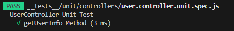
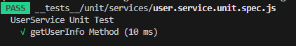
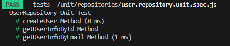

- Auth 단위 테스트
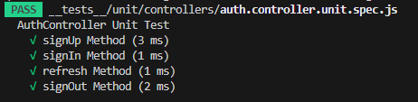
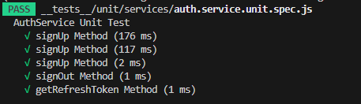
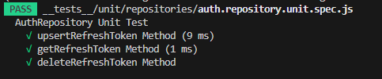

- 회원가입 API
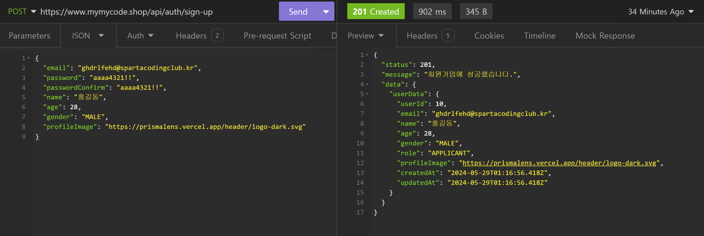

- 로그인 API


- 내 정보 조회 API
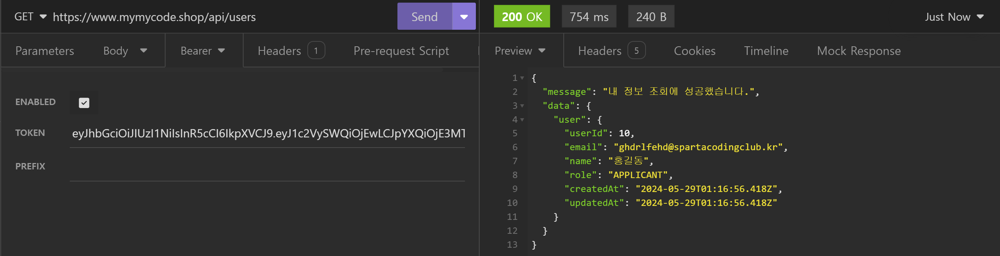

- 이력서 생성 API
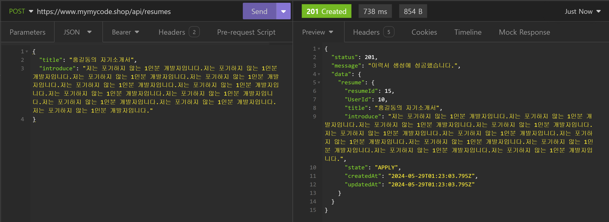

- 이력서 목록 조회 API
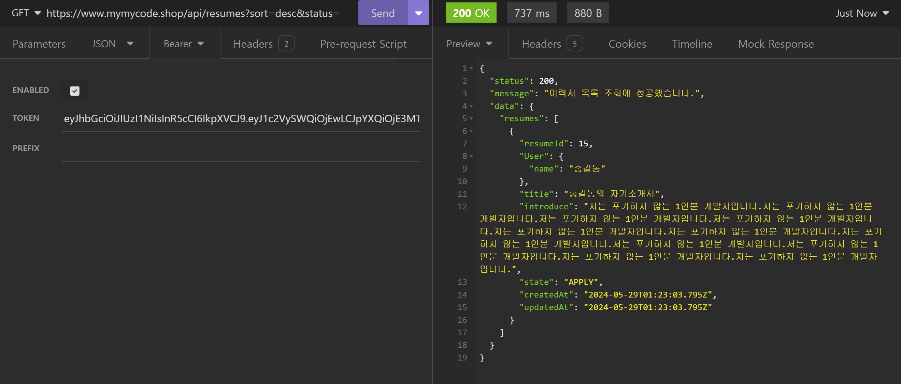

- 이력서 상세 조회 API
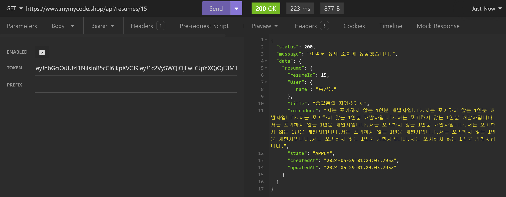

- 이력서 수정 API
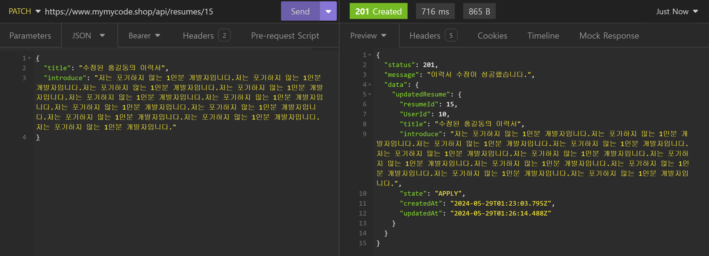

- 이력서 삭제 API
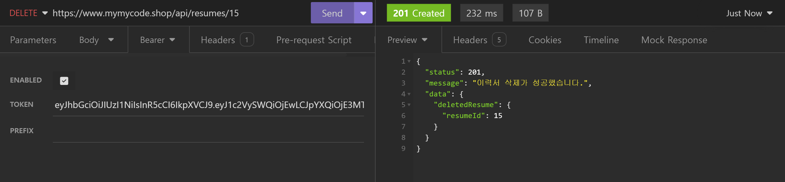

- 이력서 지원 상태 변경 API
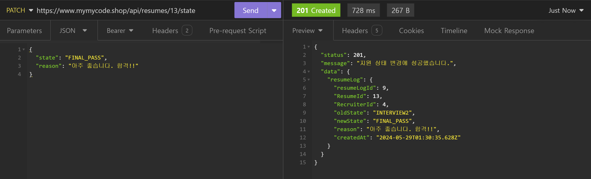

- 이력서 로그 목록 조회 API


- 토큰 재발급 API


- 로그아웃 API
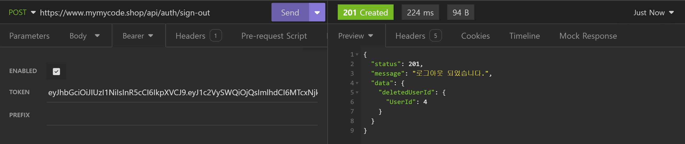

<br>

## 7. 어려웠던 점
### 7-1. 인증 미들웨어의 Prisma 코드 변경
- 3-Layered Architecture Pattern 리팩토링 중 내 정보 조회 API를 분리하고 있었음

- 어느 정도 분리가 끝나서 AccessToken 미들웨어도 코드의 구조 변화가 필요했음

- 도저히 어디를 고쳐야 할지 모르겠어서 튜터님께 도움을 요청함

- 튜터님께서 간단한 흐름을 알려주셨기에 조금 더 찾아보면서 구현을 시작함

- 찾은 방법은 인증 미들웨어에서 Prisma 클라이언트를 직접 사용하는 부분을 Service 클래스의 인스턴스로 접근하는 방식을 찾음

- 그러기 위해서는 인증 미들웨어에 Service 클래스의 인스턴스가 매개변수로 들어가야 함

- 그래서 다시 찾아보니 미들웨어도 매개변수를 가지는 형태로 바꿀 수 있다고 함

- 기존의 Prisma 클라이언트를 사용하는 방식은 다음과 같음
```javascript
import { HTTP_STATUS } from '../constants/http-status.constant.js';
import { MESSAGES } from '../constants/message.constant.js';
import { prisma } from '../utils/prisma.util.js';
import jwt from 'jsonwebtoken';

// AccessToken 인증 미들웨어
export default async (req, res, next) => {
    try {
        // 헤더에서 Access 토큰 가져옴
        const authorization = req.headers['authorization'];
        if (!authorization) throw new Error(MESSAGES.AUTH.COMMON.JWT.NO_TOKEN);

        // Access 토큰이 Bearer 형식인지 확인
        const [tokenType, token] = authorization.split(' ');
        if (tokenType !== 'Bearer') throw new Error(MESSAGES.AUTH.COMMON.JWT.NOT_SUPPORTED_TYPE);

        // 서버에서 발급한 JWT가 맞는지 검증
        const decodedToken = jwt.verify(token, process.env.ACCESS_TOKEN_SECRET_KEY);
        const userId = decodedToken.userId;

        // JWT에서 꺼낸 userId로 실제 사용자가 있는지 확인
        const user = await prisma.user.findFirst({ where: { userId: +userId }, omit: { password: true } });
        if (!user) {
            return res.status(HTTP_STATUS.UNAUTHORIZED).json({ status: HTTP_STATUS.UNAUTHORIZED, message: MESSAGES.AUTH.COMMON.JWT.NO_USER });
        }

        // 조회된 사용자 정보를 req.user에 넣음
        req.user = user;
        // 다음 동작 진행
        next();
    } catch (err) {
        switch (err.name) {
            case 'TokenExpiredError':
                return res.status(HTTP_STATUS.UNAUTHORIZED).json({ status: HTTP_STATUS.UNAUTHORIZED, message: MESSAGES.AUTH.COMMON.JWT.EXPIRED });
            case 'JsonWebTokenError':
                return res.status(HTTP_STATUS.UNAUTHORIZED).json({ status: HTTP_STATUS.UNAUTHORIZED, message: MESSAGES.AUTH.COMMON.JWT.INVALID });
            default:
                return res
                    .status(HTTP_STATUS.UNAUTHORIZED)
                    .json({ status: HTTP_STATUS.UNAUTHORIZED, message: err.message ?? MESSAGES.AUTH.COMMON.JWT.ETC });
        }
    }
};
```
- 이번에 찾은 Service 클래스의 메서드에게 그 역할을 넘기는 방법은 다음과 같음
```javascript
import jwt from 'jsonwebtoken';
import { AUTH_CONSTANT } from '../constants/auth.constant.js';
import { ERROR_CONSTANT } from '../constants/error.constant.js';
import { MESSAGES } from '../constants/message.constant.js';
import { HttpError } from '../errors/http.error.js';

// AccessToken 인증 미들웨어
export const authAccessTokenMiddleware = (userService) => {
    return async (req, res, next) => {
        try {
            // 헤더에서 Access 토큰 가져옴
            const authorization = req.headers[AUTH_CONSTANT.AUTHORIZATION];
            if (!authorization) throw new HttpError.Unauthorized(MESSAGES.AUTH.COMMON.JWT.NO_TOKEN);

            // Access 토큰이 Bearer 형식인지 확인
            const [tokenType, token] = authorization.split(' ');
            if (tokenType !== AUTH_CONSTANT.BEARER)
                throw new HttpError.Unauthorized(MESSAGES.AUTH.COMMON.JWT.NOT_SUPPORTED_TYPE);

            // 서버에서 발급한 JWT가 맞는지 검증
            const decodedToken = jwt.verify(token, process.env.ACCESS_TOKEN_SECRET_KEY);
            const userId = decodedToken.userId;

            // 사용자 정보를 UserService에게 요청
            const user = await userService.getUserInfo(userId);
            if (!user) throw new HttpError.Unauthorized(MESSAGES.AUTH.COMMON.JWT.NO_USER);

            // 조회된 사용자 정보를 req.user에 넣음
            req.user = user;
            // 다음 동작 진행
            next();
        } catch (err) {
            switch (err.name) {
                case ERROR_CONSTANT.NAME.EXPIRED:
                    next(new HttpError.Unauthorized(MESSAGES.AUTH.COMMON.JWT.EXPIRED));
                    break;
                case ERROR_CONSTANT.NAME.JWT:
                    next(new HttpError.Unauthorized(MESSAGES.AUTH.COMMON.JWT.INVALID));
                    break;
                default:
                    next(new HttpError.Unauthorized(err.message ?? MESSAGES.AUTH.COMMON.JWT.ETC));
                    break;
            }
        }
    };
};
```

<br>

### 7-2. 테스트 코드 구현 자체의 어려움
- 처음 접하는 내용이긴 하지만 너무나도 생소 했음

- Jest에서 편리한 메서드들을 제공한다고 하는데 생각보다 에러를 고치느라 찾아볼 겨를이 없었음

- 결국 GPT의 도움을 받아서 코드를 조금씩 구현함

- 한줄 한줄 주석을 달면서 작성했지만 아직도 이해가 쉽지 않음

- 내가 너무 어렵게 모든 코드들을 테스트 할려고 해서 더 복잡하고 이해가 되지 않는것 같음

- 튜터님의 해설강의를 통해서 테스트 코드의 로직과 구현 방법을 익혀보자

<br>
